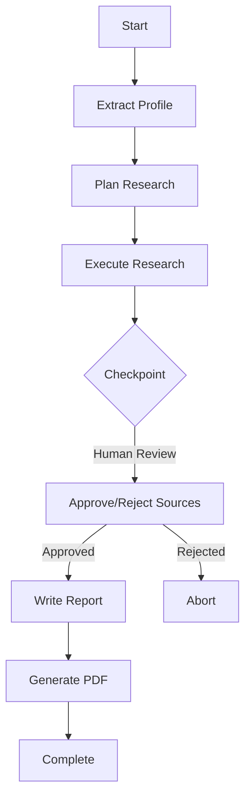

# 🏢 Hoxton Tax Limited - AI Tax Consultancy System

A professional AI-powered tax consultancy system with **human-in-the-loop checkpointing** for research review. Built with Next.js 14, FastAPI, Google Gemini, and LangGraph.

## ✨ Features

- **🔍 Intelligent Profile Extraction**: Automatically extracts client information from conversation transcripts
- **📋 Research Planning**: AI-powered research strategy generation for tax legislation
- **🔎 Legal Research**: Deep web search using Tavily API for current tax laws
- **⏸️ Human-in-the-Loop Checkpointing**: Pause workflow after research for human review and approval
- **✍️ Report Generation**: Comprehensive, professionally formatted tax reports
- **📄 PDF Export**: Beautiful, branded PDF reports with Hoxton Tax styling
- **🔄 Real-time Progress**: WebSocket-based live updates with terminal-style logs
- **🎨 Professional UI**: Vercel-inspired animations with smooth transitions

## 🏗️ Architecture

```
┌─────────────────┐         ┌──────────────────┐
│  Next.js 14     │ ◄─────► │   FastAPI        │
│  Frontend       │  REST   │   Backend        │
│  (Port 3000)    │  WebSocket (Port 8000)      │
└─────────────────┘         └──────────────────┘
        │                            │
        │                            │
        ▼                            ▼
┌─────────────────┐         ┌──────────────────┐
│  Framer Motion  │         │   LangGraph      │
│  Tailwind CSS   │         │   + Checkpointing│
└─────────────────┘         └──────────────────┘
                                     │
                            ┌────────┴─────────┐
                            │                  │
                            ▼                  ▼
                    ┌──────────────┐   ┌──────────────┐
                    │ Google Gemini│   │ Tavily Search│
                    └──────────────┘   └──────────────┘
```

## 📁 Project Structure

```
TaxAdvisor/
├── backend/                      # FastAPI Backend
│   ├── agents/
│   │   ├── nodes.py             # Agent node functions
│   │   ├── workflow.py          # LangGraph workflow with checkpointing
│   │   └── checkpoints.py       # Checkpoint management
│   ├── api/
│   │   ├── routes.py            # REST API endpoints
│   │   └── websocket.py         # WebSocket for real-time updates
│   ├── config.py                # Configuration management
│   ├── models.py                # Pydantic models
│   ├── main.py                  # FastAPI app entry point
│   └── requirements.txt         # Python dependencies
│
├── frontend/                     # Next.js 14 Frontend
│   ├── app/
│   │   ├── page.tsx             # Main UI page
│   │   ├── layout.tsx           # Root layout
│   │   └── globals.css          # Tailwind styles
│   ├── components/
│   │   ├── TranscriptInput.tsx  # Transcript input component
│   │   ├── ProgressTracker.tsx  # Animated progress stepper
│   │   ├── TerminalLogs.tsx     # Vercel-style terminal logs
│   │   ├── CheckpointReview.tsx # Human review panel
│   │   └── ReportViewer.tsx     # Report display & download
│   ├── lib/
│   │   ├── api.ts               # API client functions
│   │   ├── websocket.ts         # WebSocket hook
│   │   └── utils.ts             # Utility functions
│   ├── types/
│   │   └── index.ts             # TypeScript definitions
│   └── package.json
│
├── agent.py                      # Original CLI version (reference)
├── agent2.py                     # Enhanced CLI version (reference)
└── README.md                     # This file
```

## 🚀 Quick Start

### Prerequisites

- Python 3.11+
- Node.js 18+
- Google Gemini API Key
- Tavily API Key (for web research)

**macOS System Dependencies:**
```bash
# Required for pycairo (PDF generation)
brew install pkg-config cairo
```

### 1. Clone the Repository

```bash
git clone https://github.com/yourusername/TaxAdvisor.git
cd TaxAdvisor
```

### 2. Backend Setup

```bash
cd backend

# Create virtual environment
python -m venv venv
source venv/bin/activate  # Windows: venv\Scripts\activate

# Install dependencies
pip install -r requirements.txt

# Create .env file in project root
cd ..  # Go back to project root
cat > .env << EOF
GOOGLE_API_KEY=your_gemini_api_key_here
TAVILY_API_KEY=your_tavily_api_key_here
FRONTEND_URL=http://localhost:3000
PORT=8000
CHECKPOINT_STORAGE=memory
EOF

# Edit .env and add your actual API keys
cd backend  # Return to backend directory
```

### 3. Frontend Setup

```bash
cd ../frontend

# Install dependencies
npm install

# Optional: Create .env.local file if you need custom API URL
# Default values work for local development (http://localhost:8000)
```

### 4. Run the Application

**Terminal 1 - Backend:**
```bash
cd backend
source venv/bin/activate  # Activate virtual environment (Windows: venv\Scripts\activate)
uvicorn main:app --reload --port 8000
```

**Terminal 2 - Frontend:**
```bash
cd frontend
npm run dev
```

**Access the application:**
- Frontend: http://localhost:3000
- Backend API Docs: http://localhost:8000/docs
- Health Check: http://localhost:8000/health

## 💻 Usage

### 1. Enter Transcript

Paste a conversation between a tax advisor and client. Example format:

```
Advisor: Hi Simon, let's discuss your tax situation.
Simon: I'm moving to Saudi Arabia next month.
Advisor: And your family?
Simon: My wife is staying in London for the kids' school...
```

### 2. Start Analysis

Click **"Start Tax Analysis"** to begin the workflow:

- ✅ **Extract Profile**: AI analyzes the transcript
- ✅ **Plan Research**: Creates research strategy
- ✅ **Execute Research**: Searches tax legislation
- ⏸️ **Checkpoint**: Workflow pauses for review

### 3. Review Research

A panel slides in from the right showing:

- Client profile summary
- Research queries executed
- All sources found (with checkboxes)
- Option to add manual notes

You can:
- ✅ **Approve selected sources** and continue
- ❌ **Remove bad sources**
- ➕ **Add manual research notes**
- 🚫 **Abort** the analysis

### 4. Generate & Download Report

Once approved, the AI generates a comprehensive PDF report. The workflow continues automatically:

- ✅ **Write Report**: AI generates report using approved sources and your manual notes
- 📊 **Real-time Progress**: Watch step 4 logs stream in real-time (same as steps 1-3)
- 📄 **Completion**: When complete, the page automatically scrolls down to show:
  - "Analysis Complete" section
  - Full report preview
  - PDF download button
  - "Start New Analysis" button

**Report includes:**
- Executive Summary
- Client Situation
- UK Statutory Residence Test Analysis
- Double Tax Treaty Analysis
- Recommendations
- Disclaimer

**Note:** The processing UI (progress tracker and logs) remains visible above the completion section, so you can see the full journey on one page.

## 🔧 Configuration

### Backend Configuration

Edit `.env` in the project root:

```bash
GOOGLE_API_KEY=your_api_key_here
TAVILY_API_KEY=your_api_key_here
FRONTEND_URL=http://localhost:3000
PORT=8000
CHECKPOINT_STORAGE=memory  # Options: memory, postgres
```

### Frontend Configuration

Edit `frontend/.env.local`:

```bash
NEXT_PUBLIC_API_URL=http://localhost:8000
NEXT_PUBLIC_WS_URL=ws://localhost:8000
```

## 🎨 Design System

### Colors

- **Primary (Hoxton Green)**: `#1A4D2E`
- **Success**: `#22c55e`
- **Warning**: `#f97316`
- **Error**: `#ef4444`

### Animations

- **Terminal logs**: Fade-in from bottom (200ms, ease-out)
- **Progress steps**: Scale animation for completions (300ms)
- **Checkpoint panel**: Slide from right (400ms, ease-out)
- **No bouncy/playful animations** (professional tone)

## 📊 API Endpoints

### REST API

- `GET /api/status/{thread_id}` - Get workflow status
- `GET /api/checkpoint/{thread_id}` - Get checkpoint data for review
- `GET /api/download/{thread_id}` - Download generated PDF

### WebSocket

- `WS /ws/{thread_id}` - Real-time communication for all workflow operations

**WebSocket Message Types:**

1. **Start Workflow** (Client → Server):
   ```json
   {
     "type": "start",
     "transcript": "Advisor: Hi Simon..."
   }
   ```

2. **Resume from Checkpoint** (Client → Server):
   ```json
   {
     "type": "resume",
     "approved_sources": [0, 1, 3],
     "manual_notes": "Additional context..."
   }
   ```

3. **Server → Client Messages**:
   - `progress` - Step updates (extracting, planning, researching, writing, complete)
   - `log` - Real-time terminal logs
   - `checkpoint` - Checkpoint reached notification
   - `complete` - Workflow completion notification
   - `error` - Error messages

**Note:** All workflow operations (start, resume, progress) are handled via WebSocket for real-time streaming. REST endpoints are used only for status checks and downloads.

## 🔄 Workflow Flow



## 🧪 Testing

### Backend

```bash
cd backend
pytest  # If tests are available
```

### Frontend

```bash
cd frontend
npm run lint
npm run build  # Test production build
```

## 🚀 Deployment

### Docker (Recommended)

```bash
# Coming soon - docker-compose.yml included
docker-compose up -d
```

### Manual Deployment

**Backend:**
- Use uvicorn with production settings
- Set `CHECKPOINT_STORAGE=postgres` for persistence
- Use environment variables for secrets

**Frontend:**
- Build: `npm run build`
- Deploy to Vercel/Netlify
- Set environment variables

## 📝 Environment Variables

**Location:** Create `.env` file in the **project root** (not in `backend/` folder)

| Variable | Description | Required |
|----------|-------------|----------|
| `GOOGLE_API_KEY` | Google Gemini API key | ✅ Yes |
| `TAVILY_API_KEY` | Tavily search API key | ✅ Yes |
| `FRONTEND_URL` | Frontend URL for CORS | No (default: localhost:3000) |
| `PORT` | Backend port | No (default: 8000) |
| `CHECKPOINT_STORAGE` | Storage type (memory/postgres) | No (default: memory) |

## 🔐 Security Notes

- Never commit `.env` or `.env.local` files
- Keep API keys secure and rotate regularly
- Use HTTPS in production
- Implement rate limiting for API endpoints
- Add authentication for production use

## 🤝 Contributing

This is a private repository. For issues or improvements, please contact the repository owner.

## 📄 License

This project is for educational and professional use. Ensure compliance with:

- Google Gemini API Terms of Service
- Tavily API Terms of Service
- Relevant tax advisory regulations in your jurisdiction

## 👤 Authors

- **Abdullah Usmani** - [@Abdullah-Usmani0](https://github.com/Abdullah-Usmani0) - Original concept and backend architecture
- **Muhammad Ihza** - [@zaza-ipynb](https://github.com/zaza-ipynb) - Original concept, backend architecture, professional frontend UI, WebSocket real-time updates, and human-in-the-loop checkpointing system

## 🙏 Acknowledgments

- **Google Gemini** for powerful LLM capabilities
- **LangGraph** for multi-agent orchestration with checkpointing
- **Tavily** for advanced web search
- **Next.js** & **FastAPI** for robust web frameworks
- **Hoxton Tax Limited** for the use case and branding inspiration

## ⚠️ Disclaimer

This system is a tool to assist tax professionals. All generated reports should be reviewed by qualified tax advisors before being provided to clients. The system does not constitute professional tax advice.

## 📞 Support

For issues or questions:
1. Check the API documentation at `/docs`
2. Review terminal logs for detailed error messages
3. Ensure all environment variables are set correctly
4. Check that backend and frontend are both running

## 🗺️ Roadmap

### Future Enhancements

- [ ] **RAG Integration**: Internal knowledge base with vector database
- [ ] **Multi-modal Input**: OCR for document uploads
- [ ] **Advanced Checkpoint Features**: Query refinement, source scoring
- [ ] **User Authentication**: Multi-user support with role-based access
- [ ] **Report Templates**: Customizable PDF templates
- [ ] **Audit Trail**: Complete history of human interventions
- [ ] **PostgreSQL Integration**: Persistent checkpoint storage
- [ ] **Docker Deployment**: One-command deployment
- [ ] **API Rate Limiting**: Production-ready throttling
- [ ] **Streaming Report Generation**: Progressive report updates

---

Built with ❤️ for professional tax consultancy
